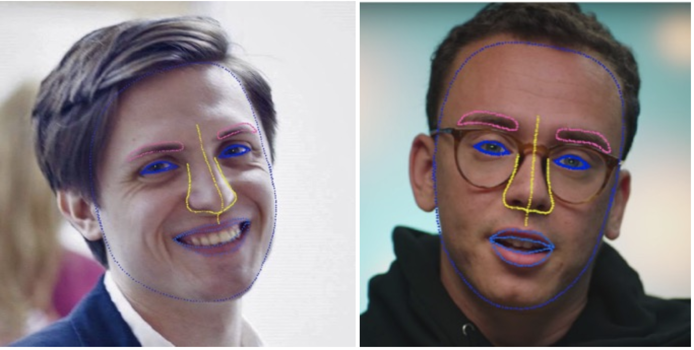
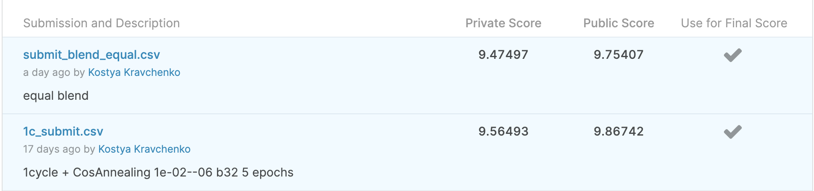
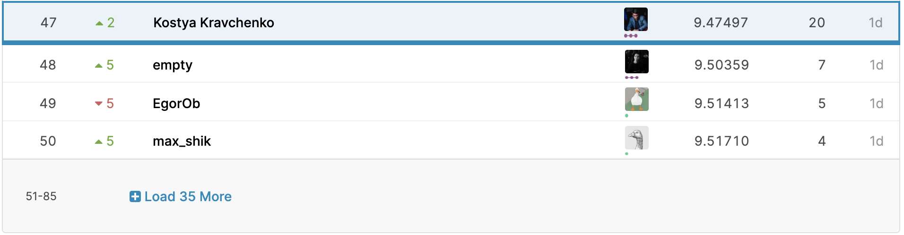

## Thousand Facial Landmarks Competition Solution within MADE Computer Vision Course
### Predict 971 facial points for VGG dataset. 
https://www.kaggle.com/c/made-thousand-facial-landmarks



### General Approach
* Warm-up with `OneCycleLR` policy and `SGD`
* Further training with `CosineAnnealingWarmRestarts` and `AdamW` with adaptive learning rates by layer
* Wing Loss from [pytorch-toolbelt](https://github.com/BloodAxe/pytorch-toolbelt)
* ImageNet normalization
* No weight decay for bias and batchnorm 
(["Bag of Tricks for Image Classification with Convolutional Neural Networks"](https://arxiv.org/abs/1812.01187))
* Simple blend with another resnet50 model


### Config
* CROP_SIZE = 128
* backbone = resnet50
* batch size = 32
* epochs = 5
* SGD_momentum = 0.9
* SGD_weight_decay = 1e-04
* OneCycle_max_lr = 0.1
* WingLoss_width = 10
* WingLoss_curvature = 2
* AdamW_weight_decay = 1e-06 
* AdamW_amsgrad = True
* Adaptive learning rates:
```
[
    {"params": model.conv1.parameters(), "lr": 1e-6},
    {"params": model.bn1.parameters(), "lr": 1e-6},
    {"params": model.relu.parameters(), "lr": 1e-5},
    {"params": model.maxpool.parameters(), "lr": 1e-5},
    {"params": model.layer1.parameters(), "lr": 1e-4},
    {"params": model.layer2.parameters(), "lr": 1e-4},
    {"params": model.layer3.parameters(), "lr": 1e-3},
    {"params": model.layer4.parameters(), "lr": 1e-3},
    {"params": model.avgpool.parameters(), "lr": 1e-2},
    {"params": model.fc.parameters(), "lr": 1e-2},
]
```

### Run
```pip install -r requirements.txt```

```python train.py --name "baseline" --data "PATH_TO_DATA" [--gpu]```

Basic blending example is available within `blender.ipynb` [notebook](blender.ipynb)

### Results



